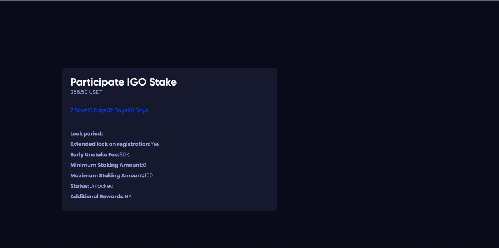
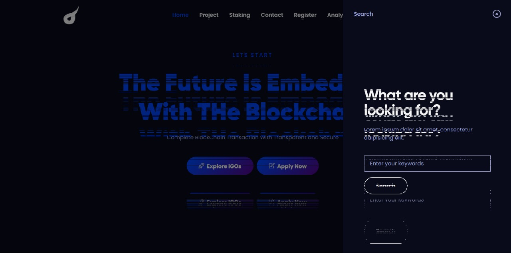

<<<<<<< HEAD
=======
# DeFi-Cross-Chain-Token-Staking-Web3
A decentralized DeFi Token Staking Application, that supports cross chain staking contractuals.

# IMPORTANT LINK FOR PROJECT
>>>>>>> db10dc0a8cc9740403e79b67fdcae471a5e7fe6f

# DeFi Token Staking Dapp

Our DeFi (Decentralized Finance) Token Staking Dapp is an innovative and user-friendly platform that allows cryptocurrency holders to maximize their earnings by participating in the staking of various tokens. Staking is a popular method in the blockchain ecosystem that enables users to earn rewards by locking up their digital assets in a secure and transparent manner. Our Dapp is designed to provide a seamless and secure staking experience, allowing users to earn passive income while supporting the operation of various blockchain networks.

## 🛠 Technologies Used

- Ethereum
- Solidity
- WanChain
- Truffle
- WanMask Wallet
- Wan X SDK
- Web3.js
- HTML + CSS

### Team Members:

1) Sai Srinivasa Vara Prasad Korlam
 - GitHub - [Vara Prasad](https://github.com/iamthebenison)
- Email - iamthebenison@gmail.com

2) Manideep Reddy S:
- GitHub - [Manideep](https://github.com/manideep2003)
- Email - saimanideep2015@gmail.com

3) Rahul Kumar Das:
- GitHub - [Rahul](https://github.com/rahuldas-404)
- Email - rahulkd403@gmail.com

4) Manideep Reddy S:
- GitHub - [manoj](https://github.com/manoj-kumar-j)
- Email - manojkumarjetti2002@gmail.com

## Screenshots

